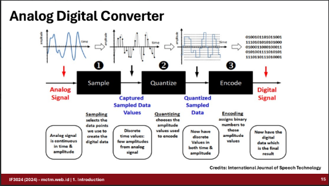
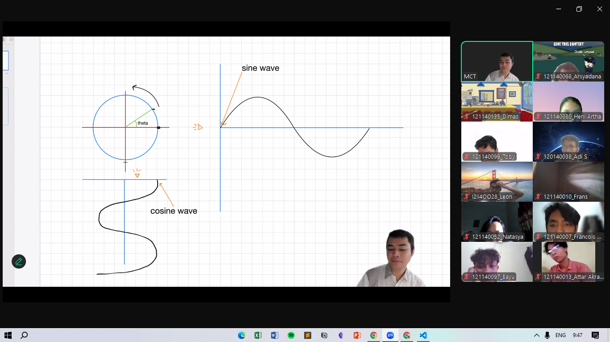
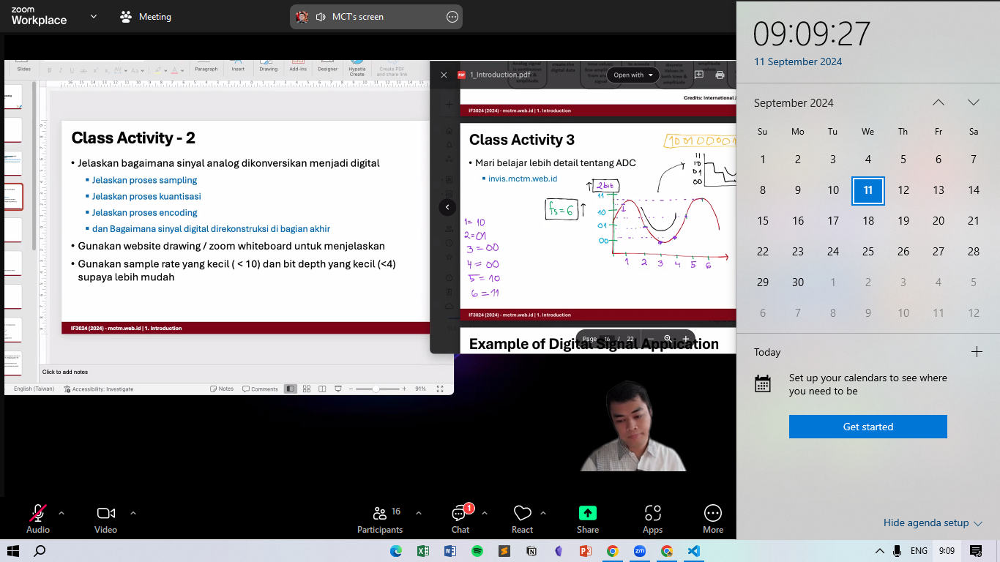

## Week1 - Complex Number 101

---

```diff
Name                  : Arsyadana Estu Aziz

NIM                   : 121140068

Dates Attended        : Wednesday, 11 September 2024

```

### Notes - Complex Number 101

- Class Activity Later

- Back to Basic:
- Sampling : Process of mapping the data from an `analog-signal` wave into a defined time - value graph
- Quatized : Process of force the graph to fit the value into the bit-map (string of n-bit) for each point in the interval of sampling
- Encoding : Process of turning that quantized value into biner value
- Reconstruction : Process of mapping this value into `digital-signal` value.

<p align="center">
  
</p>
<p align="center"><i><b>Figure 1</b> ADC Simplified </i></p>

- Signal is a Circle, mapped in two-axis graph, (e.g. `Sinus` and `Cosine` wave), with the formula:

  $$
      \text{x} = \text{r} \cdot \cos \theta \\
      \text{y} = \text{r} \cdot \cos \theta
  $$

<p align="center">
  
</p>
<p align="center"><i><b>Figure 1</b> Wave 101 </i></p>

- As wave are consist of real part and original part

### Attachment

- 
- Youtube Record: [Link](https://www.youtube.com/watch?v=AKgKI9vI08A&ab_channel=M.C.T.Manullang)
