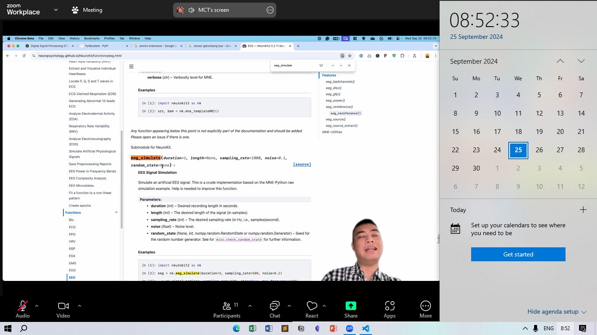

## Week4 - Python for DSP

---

```diff
Name                  : Arsyadana Estu Aziz

NIM                   : 121140068

Dates Attended        : Wednesday, 25 September 2024

```

### Notes - DSP 101

- Signal in Real Life

### Sinyal ECG (Electrocardiography)

- Sinyal yang dihasilkan oleh jantung manusia (cardio)

### Sinyal Respirasi

## Resampling

- Method to change the sampling frequencies to from a signal
- There's two kinds, oversampling and undersampling

### Attachment

- 
- Youtube Record: [Link](https://www.youtube.com/watch?v=F7XR1BjrCFU)
